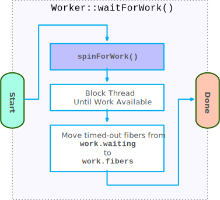
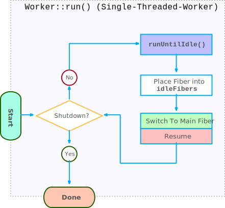
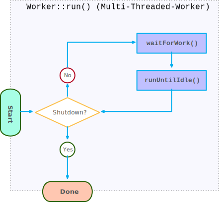

# `marl::Scheduler`

The `marl::Scheduler` is the most complex part of marl and is responsible for executing tasks and keeping threads running when tasks become blocked.

This document describes the inner workings of the scheduler. This document is not intended to describe usage.

## Binding

The scheduler must be bound to each thread that calls `marl::schedule()`, and unbound from all threads before the scheduler is destructed.

Binding is made using the `marl::Scheduler::bind()` and `marl::Scheduler::unbind()` methods.

Binding assigns a thread-local storage variable so the scheduler is associated with the given thread. This serves two purposes:

1. It allows `marl::schedule()` and the various synchronization primitives to be called without requiring a pointer to the `marl::Scheduler`.
2. More importantly, it provides a way to get the currently executing fiber for the current thread. This is used by `marl::ConditionVariable::wait()` to suspend the current fiber and place it into a vector so the `marl::ConditionVariable::notify_`xxx`()` methods can reschedule the blocked fibers.

Binding also creates an internal [Single-Threaded-Worker](#single-threaded-workers) for the calling thread. This worker is used for scheduling tasks when there are no [Multi-Threaded-Workers](#multi-threaded-workers) available. Unbinding will ensure that all scheduled tasks for the  [Single-Threaded-Worker](#single-threaded-workers) are completed before returning.

## Fibers

A [fiber](https://en.wikipedia.org/wiki/Fiber_(computer_science)) is a lightweight cooperative thread, which can be suspended and resumed at explicit yield points.

At the time of writing, there's no standard and cross-platform library for fibers or coroutines, so marl implements the `marl::OSFiber` class for each supported platform and ABI. Most of these implementations are written in assembly and simply save and restore the callee-saved registers along with maintaining an allocation for the fiber's stack. `marl::OSFiber` is an internal implementation detail, and is not exposed in the public API.

`marl::Scheduler::Fiber` is the public fiber interface that is tightly coupled with the `marl::Scheduler`. The `marl::Scheduler::Fiber` has a simple `std::condition_variable` like interface.

Each `marl::Scheduler::Fiber` is permanently associated with a `marl::Scheduler::Worker`, and is guaranteed to only ever be resumed on the same thread used to suspend.

## Tasks

A `marl::Task` is an alias to `std::function<void()>`, a function that takes no arguments, and returns no value.

Tasks are scheduled using `marl::schedule()`, and are typically implemented as a lambda:

```c++
marl::schedule([] {
    printf("Hello world!\n");
});
```

While the `marl::Task` signature takes no parameters, it is common to capture variables as part of this lambda for task inputs and outputs.

All the marl synchronization primitives (with exception of `marl::ConditionVariable`) hold a shared pointer to internal state, and you are encouraged to capture these **by value**. This may seem counter-intuitive, but passing by reference can lead to memory corruption if the task outlives the stack used to call `marl::schedule()`. Maintaining a shared state object clearly has allocation and performance overheads, but it was decided that the safety outweighed the costs.

```c++
marl::WaitGroup wg(1);
marl::schedule([=] { // capture by value, not reference!
    printf("Hello world!\n");
    wg.fire();
});
wg.wait();
```

## Workers

The scheduler holds a number of `marl::Scheduler::Worker`s. Each worker holds:

* `work.tasks` - A queue of tasks, yet to be started.
* `work.fibers` - A queue of suspended fibers, ready to be resumed.
* `work.waiting` - A queue of suspended fibers, waiting to be resumed or time out.
* `idleFibers` - A set of idle fibers, ready to be reused.
* `work.num` - A counter that is kept in sync with `work.tasks.size() + work.fibers.size()`.

When a task is scheduled with a call to `marl::schedule` a worker is picked, and the task is placed on to the worker's `work.tasks` queue. The worker is picked using the following rules:

* If the scheduler has no dedicated worker threads (`marl::Scheduler::getWorkerThreadCount() == 0`), then the task is queued on to the [Single-Threaded-Worker](#single-threaded-workers) for the currently executing thread.
* Otherwise one of the [Multi-Threaded-Workers](#multi-threaded-workers) is picked. If any workers have entered a [spin-for-work](#marlschedulerworkerspinforwork) state, then these will be prioritized, otherwise a [Multi-Threaded-Worker](#multi-threaded-workers) is picked in a round-robin fashion.

### `marl::Scheduler::Worker::run()`

`run()` is the entry point for workers to execute their tasks. The logic is slightly different based on whether the worker is a [Single-Threaded-Worker](#single-threaded-workers) or a [Multi-Threaded-Worker](#multi-threaded-workers), but both share the same basic logic:

* Enter a loop that only exits when the worker is shutdown.
* In this loop call [`marl::Scheduler::Worker::runUntilIdle()`](#marl::Scheduler::Worker::runUntilIdle())

### `marl::Scheduler::Worker::runUntilIdle()`

As the name suggests, this function executes its work until there is no more work, or all work is blocked.

The basic logic of this method is as follows:

1. Resuming any unblocked tasks (fibers)

   Workers execute by first attempting to complete any tasks that are ready to be resumed.
   This is done by taking a fiber from the `work.fibers` queue, placing the current fiber into the `idleFibers` queue (this fiber is considered idle as it is looking for work), and switching the context over to the taken fiber.

   Executing unblocked fibers is prioritized over starting new tasks. This is because new tasks may result in yet more fibers, and each fiber consumes a certain amount of memory (mostly for stack).

2. Starting new tasks

   Once all resumable fibers have been completed or have become blocked, new tasks are taken from the `work.tasks` queue, and are executed. Once a task is completed, control returns back to `runUntilIdle()`, and the main loop starts again from 1.

3. If there's neither any unblocked fibers or tasks, `runUntilIdle()` returns.


### Task suspension

Marl allows tasks to block, while keeping threads busy.

If a task blocks, then `Scheduler::Worker::suspend()` is called. `suspend()` begins by calling [`Scheduler::Worker::waitForWork()`](#marl::Scheduler::Worker::waitForWork()), which blocks until there's something else it can do. `waitForWork()` is a blocking call, so once it returns, we know there's either a task or fiber that can be executed. Then, one of the following occurs:

 1. If there's any unblocked fibers, the fiber is taken from the `work.fibers` queue and is switched to.
 2. If there's any idle fibers, one is taken from the `idleFibers` set and is switched to. This idle fiber will be suspended in its own `runUntilIdle()` loop, and when resumed, will continue the role of executing tasks.
 3. If none of the above occurs, then a new fiber needs to be created to continue executing tasks. This fiber is created to begin execution in [`marl::Scheduler::Worker::run()`](#marl::Scheduler::Worker::run()), and is switched to.

In all cases, the `suspend()` call switches to another fiber. When the suspended fiber is resumed, `suspend()` returns back to the caller.


### `marl::Scheduler::Worker::waitForWork()`

When a worker runs out of tasks to start and fibers to resume, `waitForWork()` is called to block until there's something for the worker to do.

If the worker is a [Multi-Threaded-Worker](#multi-threaded-workers), `waitForWork()` begins by entering [`spinForWork()`](#marlschedulerworkerspinforwork).

`waitForWork` then waits for any of the following to occur before returning:

* A fiber becoming ready to be resumed, by being enqueued on the `work.fibers` queue.
* A task becoming enqueued on the `work.tasks` queue.
* A fiber timing out in the `work.waiting` queue.
* The worker being shutdown.

Any fibers that have timed out in the `work.waiting` queue are automatically moved onto the `work.fibers` queue before returning.



### `marl::Scheduler::Worker::spinForWork()`

`spinForWork()` has two roles:

1. It attempts to steal work from other workers to keep worker work-loads evenly balanced.

   Task lengths can vary significntly in duration, and over time some workers can end up with a large queue of work, while others are starved. `spinForWork()` will attempt to steal tasks from randomly picked workers. Becauses fibers must only be executed on the same thread, only tasks, not fibers can be stolen.

2. It attempts to avoid yielding the thread to the OS.

   It is common to have a single task (provider) scheduling many small sub-tasks to the scheduler, which are evenly distributed to the workers (consumers). These consumers typically significantly outnumber the providers, and it is easy to have the provider struggle to provide enough work to keep the consumers fully occupied.

   In this situation, the workers can enter a loop where they are given a task, complete it, and end up waiting a short duration for more work. Allowing a worker thread to yield to the OS when waiting (say with `std::condition_variable::wait()`) can be costly in terms of performance. Depending on the platform, it may take milliseconds before the thread is resumed by the OS. A stall of this length can lead to significant stalls in the entire task queue.

`spinForWork()` contains a loop that runs for a short duration. In the body of the loop, the following is performed:

* A tight loop of `nops` is used to keep the CPU busy, while periodically checking `work.num` to see if any new work has become available. If new work is found, `spinForWork()` returns immediately.
* If no new work was scheduled, an attempt is made to steal a task from another random worker. If the steal was successful, `spinForWork()` returns immediately.
* If the steal was unsuccessful, `std::this_thread::yield()` is called to prevent marl from starving the OS.


## Worker Types

A worker is created as either a Single-Threaded-Worker or Multi-Threaded-Worker.

Most of the logic is the same between these two modes.
The most significant difference between the STW and MTW is the behavior of the worker's entry point function - `marl::Scheduler::Worker::run()`.

### Single-Threaded-Workers

A single-threaded-worker (STW) is created for each thread that is bound with a call to `marl::Scheduler::bind()`.

If the scheduler has no dedicated worker threads (`marl::Scheduler::getWorkerThreadCount() == 0`), then scheduled tasks are queued on to the STW for the currently executing thread.

Because in this mode there are no worker threads, the tasks queued on the STW are not automatically background executed. Instead, tasks are only executed whenever there's a call to [`marl::Scheduler::Worker::suspend`](#task-suspension).
The logic for `suspend()` is common for STWs and MTWs, and the first call will create a fiber which calls `marl::Scheduler::Worker::run()`.

`marl::Scheduler::Worker::run()` is implemented for STWs as a loop that calls `marl::Scheduler::Worker::runUntilIdle()`, and then switches back to the main fiber. This loop only breaks once the worker is shutdown.



```c++
void SingleThreadedWorkerExample() {
  marl::Scheduler scheduler;
  scheduler.setWorkerThreadCount(0); // STW mode.
  scheduler.bind();
  defer(scheduler.unbind());

  // Calling marl::schedule() enqueues the task on the STW, but does not
  // execute it until the thread is blocked.
  marl::Event done;
  marl::schedule([=] {
    done.signal();
  });

  // This is a blocking call.
  // marl::Event::wait() (indirectly) calls marl::Scheduler::Worker::suspend().
  // marl::Scheduler::Worker::suspend() creates and switches to a fiber which
  // calls marl::Scheduler::Worker::run() to run all enqueued tasks. The fiber
  // then places itself into idleFibers set and switches back to the main fiber
  // to continue execution.
  done.wait();
}
```

### Multi-Threaded-Workers

Multi-Threaded-Workers are created when `marl::Scheduler::setWorkerThreadCount()` is called with a positive number.

Each MTW is paired with a new `std::thread` that calls `marl::Scheduler::Worker::run()`.

`marl::Scheduler::Worker::run()` is implemented for MTWs as a loop that calls `marl::Scheduler::Worker::waitForWork()` followed by `marl::Scheduler::Worker::runUntilIdle()`. This loop only breaks once the worker is shutdown.

